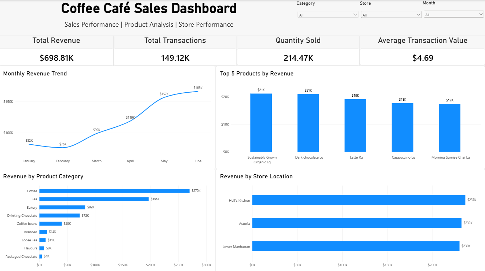

# ☕ Coffee Café Sales & Transaction Analysis

An end-to-end sales analytics project using **Power BI and Tableau** to analyze coffee café transactions, revenue performance, product performance, store performance, and monthly sales trends.

---

## 📌 Project Overview

This project analyzes **149,116 coffee café transactions** recorded across three store locations during the period **January 2023 to June 2023**.

The objective is to transform raw transaction data into meaningful business insights using interactive dashboards and analytical techniques.

The project is being developed using two leading business intelligence tools:

- **Power BI**
- **Tableau**

The same business dataset will be analyzed separately in each tool to demonstrate dashboard development, data modeling, calculated measures, and business storytelling.

---

## 🎯 Business Objectives

The analysis focuses on answering the following questions:

- How is the café performing overall?
- How does revenue change over time?
- Which product categories generate the most revenue?
- Which individual products are the top revenue contributors?
- Which store locations generate the most revenue?
- How does sales quantity compare with revenue performance?
- What areas require further investigation?

---

## 📊 Dataset Overview

| Attribute | Details |
|---|---|
| Total Transactions | 149,116 |
| Total Quantity Sold | 214,470 |
| Total Revenue | $698,812.33 |
| Average Transaction Value | $4.69 |
| Store Locations | 3 |
| Product Categories | 9 |
| Products | 80 |
| Analysis Period | January 2023 – June 2023 |
| Dataset Columns | 11 |

### Main Dataset Fields

- `transaction_id`
- `transaction_date`
- `transaction_time`
- `transaction_qty`
- `store_id`
- `store_location`
- `product_id`
- `unit_price`
- `product_category`
- `product_type`
- `product_detail`

---

## 🛠️ Tools & Technologies

### Power BI
- Data modeling
- DAX
- Interactive dashboards
- KPI cards
- Time-series analysis
- Top-N analysis
- Slicers and filtering

### Tableau
- Data visualization
- Calculated fields
- Interactive dashboards
- Business analysis
- Visual storytelling

### Supporting Tools
- Microsoft Excel
- GitHub

---

# 📈 Power BI Analysis

The Power BI dashboard focuses on four major areas:

### 1. Overall Business Performance
Key performance indicators include:

- Total Revenue
- Total Transactions
- Quantity Sold
- Average Transaction Value

### 2. Revenue Trend
Monthly revenue is analyzed to identify changes in sales performance throughout the six-month period.

### 3. Product Performance
The dashboard analyzes:

- Revenue by product category
- Top 5 products by revenue

### 4. Store Performance
Revenue is compared across the three café locations.

### Dashboard



---

## 🔑 Key Power BI Insights

- Total revenue generated during the analysis period was approximately **$698.81K**.
- The café recorded approximately **149.12K transactions**.
- Total quantity sold was approximately **214.47K units**.
- The average transaction value was approximately **$4.69**.
- **Coffee** was the highest revenue-generating product category.
- **June** recorded the highest monthly revenue.
- **February** recorded the lowest monthly revenue.
- **Hell's Kitchen** generated the highest revenue among the three store locations.
- **Sustainably Grown Organic Lg** was the highest-revenue individual product.
- Revenue and quantity rankings were not always identical, showing that sales volume and revenue provide different perspectives on store and product performance.

---

## 💡 Business Recommendations

Based on the analysis:

- Continue monitoring the performance of the **Coffee** category because of its significant contribution to revenue.
- Investigate the lower revenue observed in **February** using additional information such as promotions, customer traffic, product availability, and seasonality.
- Compare product mix and pricing across store locations to understand differences between revenue and quantity performance.
- Monitor high-revenue products to understand their contribution to overall business performance.

> These recommendations are based on transaction-level sales data. Additional business data would be required to determine the specific causes behind observed trends.

---
## 📁 Project Structure

```text
Coffee-Cafe-Sales-Analysis/
│
├── README.md
│
├── data/
│   └── Coffee Shop Sales.xlsx
│
├── PowerBI/
│   └── Coffee_Cafe_Sales_Analysis.pbix
│
├── Documentation/
│   └── PowerBI_Documentation.md
│
├── Presentation/
│   └── Coffee_Cafe_Sales_Analysis_Presentation.pptx
│
└── Screenshots/
    └── PowerBI_Dashboard.png
```

